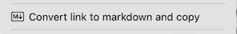
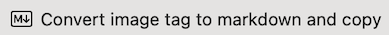
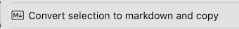
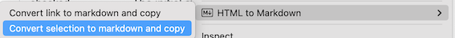

# HTML to Markdown Chrome Extension

https://chrome.google.com/webstore/detail/html-to-markdown/kgfecdionnddbhjfeanngjbpnnglnpho

## Convert Link to Markdown and Copy

Right click on a link and select  to convert the selected link to its markdown equivalent (e.g. `[Link Text](link-url)`) and store in clipboard

## Convert Image to Markdown and Copy

Right click on an image and select  to convert the selected image to its markdown equivalent (e.g. ``) and store in clipboard

## Convert Selection to Markdown and Copy

Right click on your selection and select  to store converted markdown in clipboard

Note: if you click on a link or image in your selection, the "Convert Selection..." option may be grouped with "Convert Link..." and/or "Convert Image..." in chrome's context menu 

## Note

Chrome may prompt you to grant clipboard permission 

## Acknowledgement

[Turn down](https://github.com/domchristie/turndown) performs conversion from HTML to Markdown
